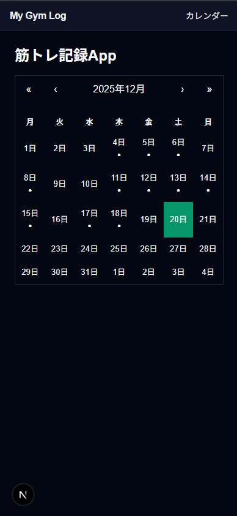
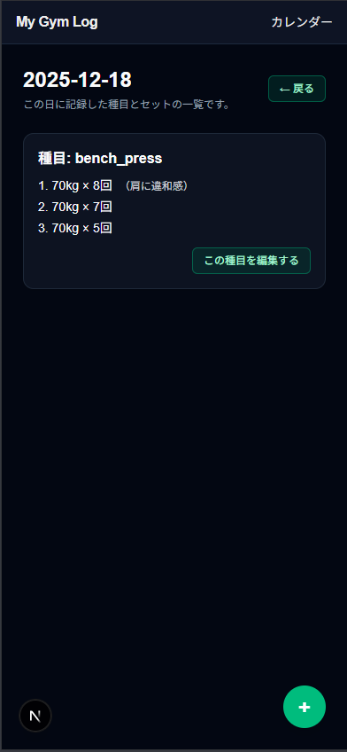
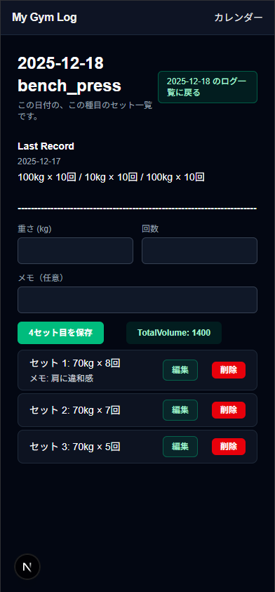

<div id="top"></div>
My Gym Next


筋トレの記録を
「日付 × 種目 × セット（重量・回数・メモ）」
で管理する Web アプリです。
カレンダーから日付を選び、
その日のトレーニング内容をシンプルに記録できます。
- Demo: my-gym-next-js-e12o36x5q-mitsutakaninomiyas-projects.vercel.app
- GitHub: https://github.com/MitsutakaNinomiya/my-gym-next.js-app

使用技術
<p style="display: inline">      </p> <p align="right">(<a href="#top">トップへ</a>)</p>


## Screenshots

### Calendar


### Daily Logs（日付ごとのログ一覧）


### Exercise Detail（セット管理）



プロジェクトについて

カレンダー中心で「いつトレーニングしたか」が分かる

日付ごとに、種目とセット内容を管理できる

前回の記録（Last Record） を見ながら記録できる

筋トレをしていて
「前回どれくらい挙げてたっけ？」
となることが多かったため作成しました。


実装の工夫 / 技術ポイント

ルーティング:/logs/[date]/[exerciseId] のように日付と種目でページを分け、URLだけで状態を表現した。
データ設計：１セット＝１行で保存し、set_indexで並び順を管理
UI：セットの追加・編集・削除をコンポーネント分割(AddSetForm/EditSetRow/DeleteSetButton)
エラー対応：Supabase通信失敗時のエラー表示

<p align="right">(<a href="#top">トップへ</a>)</p>
画面構成 / ルーティング
/                         カレンダー
/logs/[date]              日別ログ一覧
/logs/[date]/select       種目選択
/logs/[date]/[exerciseId] 種目別ログ


カレンダーの日付を押すと、その日のログ画面に遷移します

記録がない場合は「＋」から種目を選んで追加できます

<p align="right">(<a href="#top">トップへ</a>)</p>
主な機能

月カレンダー表示（記録がある日にマーク表示）

日付ごとのトレーニングログ一覧

種目ごとのセット管理（重量 / 回数 / メモ）

セットの追加・編集・削除

同じ種目の直近記録（Last Record）の表示

<p align="right">(<a href="#top">トップへ</a>)</p>
ディレクトリ構成（抜粋）
app/
  page.tsx                # カレンダー
  CalendarClient.tsx
  logs/
    [date]/
      page.tsx            # 日別ログ
      select/
        page.tsx          # 種目選択
      [exerciseId]/
        page.tsx          # 種目別ログ
        AddSetForm.tsx
        EditSetRow.tsx
        DeleteSetButton.tsx

lib/
  supabaseClient.ts

<p align="right">(<a href="#top">トップへ</a>)</p>
データモデル（Supabase）
logs テーブル（1セット = 1行）
カラム名	説明
date	トレーニング日
exercise_id	種目ID
set_index	セット番号
weight	重量
reps	回数
memo	メモ（任意）
開発環境
npm install
npm run dev


.env.local に Supabase の URL と KEY を設定しています。

今後やりたいこと

現状は単一ユーザー想定（学習用）/ 今後Auth導入予定

Volume が更新されたときに分かる表示

種目を部位ごとに分類

コード整理（API Route の利用）

<p align="right">(<a href="#top">トップへ</a>)</p>


This is a [Next.js](https://nextjs.org) project bootstrapped with [`create-next-app`](https://nextjs.org/docs/app/api-reference/cli/create-next-app).

## Getting Started

First, run the development server:

```bash
npm run dev
# or
yarn dev
# or
pnpm dev
# or
bun dev
```

Open [http://localhost:3000](http://localhost:3000) with your browser to see the result.

You can start editing the page by modifying `app/page.tsx`. The page auto-updates as you edit the file.

This project uses [`next/font`](https://nextjs.org/docs/app/building-your-application/optimizing/fonts) to automatically optimize and load [Geist](https://vercel.com/font), a new font family for Vercel.

## Learn More

To learn more about Next.js, take a look at the following resources:

- [Next.js Documentation](https://nextjs.org/docs) - learn about Next.js features and API.
- [Learn Next.js](https://nextjs.org/learn) - an interactive Next.js tutorial.

You can check out [the Next.js GitHub repository](https://github.com/vercel/next.js) - your feedback and contributions are welcome!

## Deploy on Vercel

The easiest way to deploy your Next.js app is to use the [Vercel Platform](https://vercel.com/new?utm_medium=default-template&filter=next.js&utm_source=create-next-app&utm_campaign=create-next-app-readme) from the creators of Next.js.

Check out our [Next.js deployment documentation](https://nextjs.org/docs/app/building-your-application/deploying) for more details.
# my-gym-next.js-app
